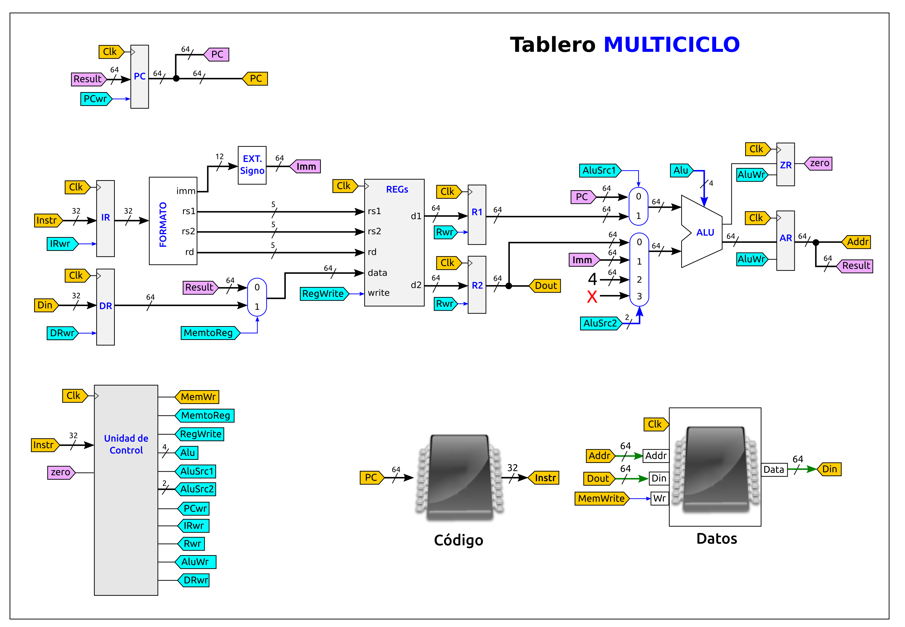

# Examen de Arquitectura de Computadores (GISAM)
* **Fecha**: 21-Enero-2021
* Tipo de examen: Remoto

## Pregunta 1 (2.5 puntos): Rendimiento 

Se tienen dos implementaciones, 1 y 2, del **mismo juego de instrucciones**. El repertorio tiene **cuatro clases** de instrucciones: de tipo A, de tipo B, de tipo C y de tipo D. La frecuencia de reloj y el CPI de cada implementación se muestran en la siguiente tabla:

 |    | Fr     |   CPI A |  CPI B |  CPI C  |  CPI D |
 |----|--------|---------|--------|---------|--------|
 |  1 |  4 GHz |   1     |   1    |   3     |   3    |
 |  2 |  2 GHz |   1     |   2    |   2     |   2    |
 
	
Para **comparar** ambas arquitecturas se utiliza un **programa de pruebas** en un lenguaje de alto nivel, que al compilarlo genera un total de 500 instrucciones, repartidas de la siguiente forma:

    10% clase A
    30% clase B
    40% clase C
    20% clase D

Responde a las siguientes preguntas:

* a) Calcula el número de ciclos de reloj total que tarda cada arquitectura en ejecutar el programa de pruebas (0.5)
* b) Calcula el CPI de cada arquitectura (0.5)
* c) Calcula el tiempo de CPU total que tarda cada carquitectura en ejecutar el programa de pruebas (0.5)
* d) A partir de los datos obtenidos en los apartados anteriores, indica qué arquitectura es la más rápida, y cuánto más rápida es una sobre la otra (0.5)
* e) Si el mismo programa de prueba se implementa en otro lenguaje de alto nivel diferente del original, y se usa un compilador también distinto, justifica si los tiempos de CPU serían exactamente los mismos o habría cambios (0.5)

## Pregunta 2 (2.5 Puntos): Repertorio de instrucciones

Un computador tiene una **arquitectura registro-memoria**, con **16 registros** de propósito general de **32 bits**, denotados por x0 - x15. Las direcciones de memoria son de 32 bits y las variables almacenadas en memoria son palabras de 32 bits también. El fabricante nos proporciona el formato de las instrucciones store, add (suma) y sub (resta) 

La operación de suma realiza la operación: Reg = Reg + dato, y la de resta: Reg = Reg - dato. El ensamblador acepta esta sintáxis para las instrucciones:

* add reg, dir
* sub reg, dir
* store reg, dir

En memoria están almacenadas las variables a, b, y c. Se quiere hacer la operación g = a - b - c , dejando el resultado en la variable de memoria g. Supon que los registros del computador B están inicialmente a 0

* a) Escribe un fragmento de programa en el ensamblador de este computador que realice esta operación (0.5)
* b) Calcula el número de accesos totales a memoria que se realizan, indicando cuáles son de lectura y cuáles de escritura (0.5)
* c) Calcula el tráfico total en bytes que se intercambian el procesador y la memoria principal (1)
* d) Supón que las variables a,b,c y g están situadas consecutivamente en la memoria, a partir de la dirección **0x2C008400**, escribe el código máquina del programa del apartado a (0.5)

## Pregunta 3 (2.5 Puntos): Circuitos lógicos

Dado el siguiente circuito

* a) Explica brevemente la estructura y componentes de este circuito (0.5)
* b) Calcula el retardo de la parte combinacional (0.5)
* c) Calcula la frecuencia máxima de funcionamiento a la que podría funcionar (0.5)
* d) Si inicialmente todas las señales están a 0, indica el valor del registro transcurridos 3 ciclos de reloj. La señal Sel está todo el tiempo a 0 (0.5)
* e) ¿Qué ocurre cuando Sel se pone a 1 durante varios ciclos de reloj? (0.5)

## Pregunta 4 (2.5 Puntos): NanoRisc-V

Se ha construido el procesador NanoRISC-V monociclo cuyo esquema se muestra en la figura. El ingeniero Hardware nos ha proporcionado los siguientes datos sobre los componentes usados:

| Componente                | Retardo |
|---------------------------|---------|
|  Memoria de instrucciones | 170ps   |
|  Sumador                  | 20ps    |
|  ALU                      | 50ps    |
|  Memoria de datos         | 200ps   |
|  Banco de registros       | 80ps    | 
|  Unidad de control        | 33ps    |

Para el resto de componentes supondremos que su retardo es despreciable por lo que asumiremos un valor de 0

* a) Calcular el retardo de cada una de las fases: Fetch, Decodificación, Ejecución, Acceso a memoria y WriteBack para las instrucciones addi, ld, sd y beq (1 pto)

| Instrucción | Fetch | Decod | Ejecución | Memoria | WriteBack |
|-------------|-------|-------|-----------|---------|-----------|
| addi        |       |       |           |         |           |
| ld          |       |       |           |         |           |
| sd          |       |       |           |         |           |
| beq         |       |       |           |         |           |

* b) Indicar cuál es la instrucción crítica y calcular la frecuencia máxima de funcionamiento (0.5)

* c) El ingeniero hardware nos ofrece la posibilidad de incluir una unidad de control muchísimo más rápida que la actual, con un retardo de sólo 5ps. ¿Cuánto se mejora el rendimiento del procesador? (0.5)

* d) Calcular la frecuencia máxima de funcionamiento si ahora utilizamos la versión Multiciclo del NanoRISC-V, con los mismos datos de la tabla inicial, y suponiendo que el resto de componentes tienen un retardo igual a 0 (0.5)

### Figura del Risc-V Monociclo

### Figura del Risc-V Multiciclo

