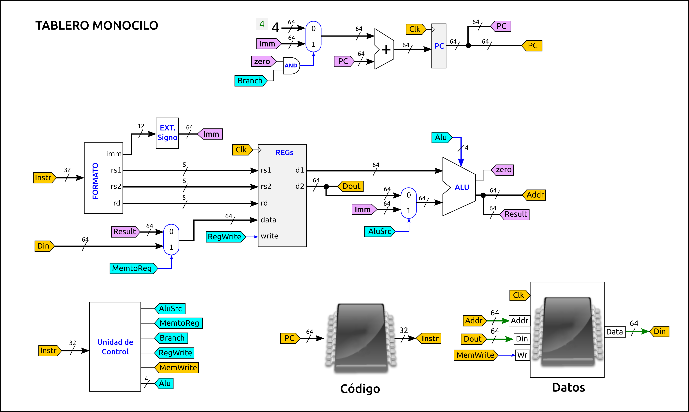
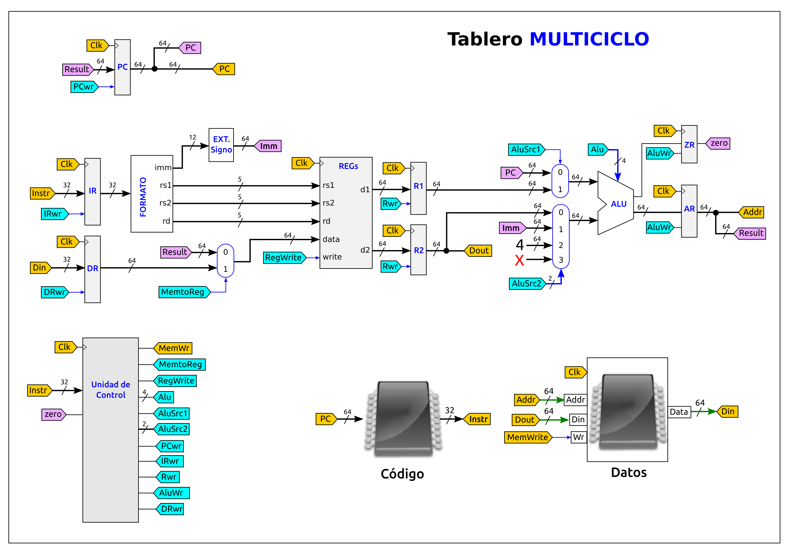

# Examen de Arquitectura de Computadores (GISAM)
* **Fecha**: 21-Enero-2021
* Tipo de examen: Remoto


## Pregunta 1 (2.5 puntos): Rendimiento 

* a) Calcula el número de ciclos de reloj total que tarda cada arquitectura en ejecutar el programa de pruebas (0.5)

  Hay que multiplicar el Número de instrucciones de cada tipo por su CPI y sumarlo. I es el número total de instrucciones del programa de prueba: 500

  * **Arquitectura 1**: (I * 0.1 * 1) + (I * 0.3 * 1) + (I * 0.4 * 3) + (I * 0.2 * 3) =  **1100 ciclos**

  * **Arquitectura 2**: (I * 0.1 * 1) + (I * 0.3 * 2) + (I * 0.4 * 2) + (I * 0.2 * 2) = **950 ciclos**

* b) Calcula el CPI de cada arquitectura (0.5)

El CPI lo calculamos dividiendo el número de ciclos totales empleados en la ejecución del programa de prueba, dividido entre el número total de instrucciones que tiene

 * **Arquitectura 1**: CPI1 = ciclos1 / I = 1100 / 500 =  **2.2**
 * **Arquitectura 2**: CPI2 = ciclos2 / I = 950 / 500 = **1.9**

* c) Calcula el tiempo de CPU total que tarda cada carquitectura en ejecutar el programa de pruebas (0.5)

El tiempo de CPU es número de ciclos totales multiplicado por el periodo de cada ciclo

 * **Arquitectura 1**: Tcpu1 = Ciclos1 * T1 = 1100 * 1 / Frec = 1100 * 1 / 4GHz = 1100 / 4 ns = **275** ns

 * **Arquitectura 2**: tcpu2 = ciclos2 * T2 = 950 * 1 / Frec = 950 * 1 / 2GHz = 950 / 2 = **475** ns


* d) A partir de los datos obtenidos en los apartados anteriores, indica qué arquitectura es la más rápida, y cuánto más rápida es una sobre la otra (0.5)

Para comparar arquitecgturas usamos el rendimiento relativo:

n = Rend1 / Rend2 = Tcpu2 / Tcpu1 = 475 / 275 = **1.73**

La **arquitectura 1 es 1.73 veces más rápida** que la 2


* e) Si el mismo programa de prueba se implementa en otro lenguaje de alto nivel diferente del original, y se usa un compilador también distinto, justifica si los tiempos de CPU serían exactamente los mismos o habría cambios (0.5)

Tanto el lenguaje empleado como el compilador determinarán qué tipo de instrucciones se usan y cuántas hay en el programa de prueba. Al utilizar otro lenguaje y otro compilador, el número de instrucciones usado de cada tipo variará y por tanto los tiempos de cpu también variarán (Por ejemplo, el compilador podría generar más instrucciones de tipo D que tipo A)

## Pregunta 2 (2.5 Puntos): Repertorio de instrucciones

* a) Escribe un fragmento de programa en el ensamblador de este computador que realice esta operación (0.5)

Para realizar la operación pedida: `g = a - b -c` podemos elegir el registro que queramos, por ejemplo el x1:

```asm
add x1, a   #-- x1 = 0 + a
sub x1, b   #-- x1 = x1 - b
sub x1, c   #-- x1 = x1 - c
store x1, g #-- Almacenar x1 en g
```

* b) Calcula el número de accesos totales a memoria que se realizan, indicando cuáles son de lectura y cuáles de escritura (0.5)

Las instrucciones están en memoria, por lo que para ejecutar cada una de ellas hay que leerla primero de memoria. Por tanto habrá 4 accesos de lectura para leer las instrucciones.

Al ejecutar las instrucciones add y sub, hay un acceso a memoria, para leer la variable indicada. En la instrucción estore hay 1 acceso de escritura

  * Número de accesos de lectura = 4 + 3 = 7
  * Número de accesos de escritura = 1
  * Total número de accesos a memoria: 8


* c) Calcula el tráfico total en bytes que se intercambian el procesador y la memoria principal (1)

A partir del formato de las instrucciones, vemos que tienen un tamaño de 40 bits (5 bytes). El tráfico generado para la lectura de las instrucciones es de 4 * 5 = 20 bytes.  Las variables de memoria son de 32 bits (4 bytes). En todas las instrucciones se lee o escribe una variable, por lo que se transfieren 4 * 4 = 16 bytes

Por tanto, el tráfico total es de: 20 + 16 = **36 bytes**


* d) Supón que las variables a,b,c y g están situadas consecutivamente en la memoria, a partir de la dirección **0x2C008400**, escribe el código máquina del programa del apartado a (0.5)

Instrucción: add x1, a:  Opcode: 0xA, x1=0x1, a=0x2C008400. Siguiendo el formato de la instrucción, se codifica así: 0x2C0084001A

Repetiendo para todas las instrucciones tenemos que el **código máquina** es:

```
0x2C0084001A
0x2C0084041B
0x2C0084081B
0x2C00840C1F
```


## Pregunta 3 (2.5 Puntos): Circuitos lógicos

* a) Explica brevemente la estructura y componentes de este circuito (0.5)

El circuito está formado por la conexión en anillo de un registro de 8 bits (parte secuencial) con otro circuito combinacional, que a su vez está dividido en un sumador de 8 bits y un multiplexor (ambos combinacionales)

* b) Calcula el retardo de la parte combinacional (0.5)

El retardo de la parte combinacional lo determina el camino que va desde la salida del registro hasta llegar otra vez a su entrada: 2ns (sumador) + 2n (mux) = 4ns

* c) Calcula la frecuencia máxima de funcionamiento a la que podría funcionar (0.5)

Para el cálculo de la frecuencia máxima tenemos que calcular el tiempo mínimo que transcurre desde que hay un dato estable en la entrada del registro hasta que llega un nuevo dato estable. Este tiempo es de: 4ns + 4ns = 8ns. Por tanto, la frecuencia máxima de funcionamiento es de: 1 / 8ns = 125Mhz


* d) Si inicialmente todas las señales están a 0, indica el valor del registro transcurridos 3 ciclos de reloj. La señal Sel está todo el tiempo a 0 (0.5)

Como la señal sel está a 0, lo que llega a la entrada del registro es su propio valor incrementado en una unidad (configuración típica en anillo). Por tanto, en el primer ciclo se captura un 1, en el segundo un 2 y en el tercero habrá un 3

* e) ¿Qué ocurre cuando Sel se pone a 1 durante varios ciclos de reloj? (0.5)

  Cuando sel se pone a 1, lo que llega a la entrada del registro es un 0, por lo que el registro se inicialice. Mientras sel valga 1, el registro valdrá 0


## Pregunta 4 (2.5 Puntos): NanoRisc-V

* a) Calcular el retardo de cada una de las fases: Fetch, Decodificación, Ejecución, Acceso a memoria y WriteBack para las instrucciones addi, ld, sd y beq (1 pto)

El retardo de la fase Fetch lo determina la memoria de instrucciones. El decodificación el banco de registros. La ejecución por la ALU. El acceso a memoria por el retardo de la memoria de datos y finalmente el writeback será siempre 0 salvo para beq, que está determinado por el retardo del sumador

En este ejercicio nos están dando el retardo de la unidad de control. La generación de las señales de control se hace en paralelo con la fase de decodificación en la ruta de datos, que lleva más tiempo. Por tanto, el camino crítico es debido al retardo del banco de registros

  * Instrucción **addi**:
    * Fetch: 170 ps, Decod: 80 ps, Ejec: 50ps,  Total: **300 ps**
  * Instrucción **ld**:
    * Fetch: 170ps, Decod: 80 ps, Ejec: 50ps, Mem: 200ps. Total: **500 ps**
  * Instrucción **sd**:
    * Fetch: 170ps, Decod: 80 ps, Ejec: 50ps, Total: **300 ps**
  * Instrucción **beq**:
    * Fetch: 170ps, Decod: 80 ps, Ejec: 50ps, WB: 20 ps. Total: **320 ps**


* b) Indicar cuál es la instrucción crítica y calcular la frecuencia máxima de funcionamiento (0.5)

La instrucción crítica es la que tarda más tiempo en ejecutarse. Es la de load, con un retardo de 500ps. Por tanto, será la instrucción que determina la frecuencia máxima de funcionamiento del procesador: 1 / 500ps = 2Ghz

* c) El ingeniero hardware nos ofrece la posibilidad de incluir una unidad de control muchísimo más rápida que la actual, con un retardo de sólo 5ps. ¿Cuánto se mejora el rendimiento del procesador? (0.5)

Por lo indicado en el apartado a, el retarde de la unidad de control es menor que el del banco de registros, por lo que su valor no determina el de la etapa de decodificación. Aunque se reduzca este tiempo, la frecuencia de funcionamiento seguirá siendo la misma: **2GHz**

* d) Calcular la frecuencia máxima de funcionamiento si ahora utilizamos la versión Multiciclo del NanoRISC-V, con los mismos datos de la tabla inicial, y suponiendo que el resto de componentes tienen un retardo igual a 0 (0.5)

Para calcular la frecuencia del multiciplo nos tenemos que fijar en la etapa más lenta, que es la de acceso a la memoria de datos: 200ps. Por tanto, la frecuencia será: 1 / 200ps = **5Ghz**

### Figura del Risc-V Monociclo



### Figura del Risc-V Multiciclo

