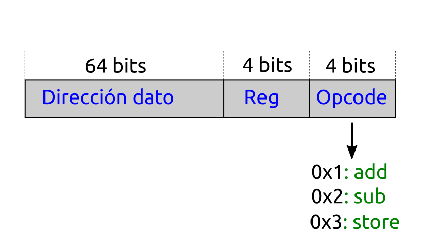
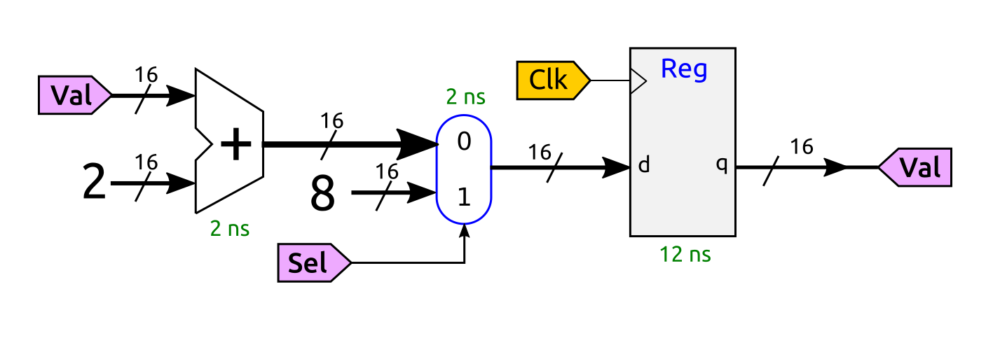

# Examen de Arquitectura de Computadores (GISAM)
* **Fecha**: 10-Enero-2022
* Tipo de examen: Presencial (Pero realizado por Aula Virtual)

## Pregunta 1 (2.5 puntos): Rendimiento 

Tenemos 3 computadores diferentes, A, B y C, y queremos comparar su rendimiento. Para ello escribimos un **programa de prueba** en un **lenguaje de alto nivel**, que traducimos al ensamblador de cada procesador mediante sus correspondientes compiladores

En la documentación técnica de cada computador encontramos esta información:

| Computador | Frecuencia (GHZ) | CPI |
|------------|------------------|-----|
| A          |  1               | 1   |
| B          |  1.5             | 1.2 |
| C          |  2               | 1.3 |

Al compilar el programa de pruebas para cada computador, se obtienen programas ejecutables (en código máquina) con el siguiente número de instrucciones:

| Compilador | Numero de instrucciones |
|------------|-------------------------|
| A          |   600                   |
| B          |   700                   |
| C          |   800                   |

Responde a las siguientes preguntas:

* a) Calcula el número de ciclos de reloj totales que tarda cada computador en ejecutar el programa de pruebas (0.5)
* b) Si sólo tuviésemos en cuenta el número de ciclos totales, ¿Qué computador tendría elegirías? (0.5)
* c) Calcula el tiempo de CPU total que tarda cada computador en ejecutar el programa de pruebas (0.5)
* d) A partir de los datos obtenidos en los apartados anteriores, indica qué computador es el más rápido, y cuánto más rápido es uno sobre el otro (0.5)
* e) Suponiendo que no podemos modificar ni el CPI y ni la frecuencia de cada computador, ¿Cómo podríamos mejorar los resultados del computador C? (0.5)

## Pregunta 2 (2.5 Puntos): Repertorio de instrucciones

Un computador tiene una **arquitectura registro-memoria**, con **16 registros** de propósito general de **64 bits**, denotados por x0 - x15. Las direcciones de memoria son de 64 bits y las variables almacenadas en memoria son palabras de 64 bits también. El fabricante nos proporciona el formato de las instrucciones store, add (suma) y sub (resta) 

La operación de suma realiza la operación: Reg = Reg + dato, y la de resta: Reg = Reg - dato. El ensamblador acepta esta sintáxis para las instrucciones:

* add reg, dir
* sub reg, dir
* store reg, dir

En memoria están almacenadas tres variales, que denotaremos por w, y, z. Se quiere hacer la operación f = w + y - z , dejando el resultado en la variable de memoria f. Supón que los registros del computador B están inicialmente a 0

* a) Escribe un fragmento de programa en el ensamblador de este computador que realice esta operación (0.5)
* b) Calcula el número de accesos totales a memoria que se realizan, indicando cuáles son de lectura y cuáles de escritura (0.5)
* c) Calcula el tráfico total en bytes que se intercambian el procesador y la memoria principal (1)
* d) Supón que las variables w,y,z y f están situadas consecutivamente en la memoria, a partir de la dirección **0x000000102A00E00**, escribe el código máquina del programa del apartado a) (Escribe las instrucciones en hexadecimal) (0.5)

## Pregunta 3 (2.5 Puntos): Circuitos lógicos

Dado el siguiente circuito

* a) Explica brevemente la estructura y componentes de este circuito (0.5)
* b) Calcula el retardo de la parte combinacional (0.5)
* c) Calcula la frecuencia máxima de funcionamiento a la que podría funcionar (0.5)
* d) Si inicialmente todas las señales están a 0, indica el valor del registro transcurridos 3 ciclos de reloj. La señal Sel está todo el tiempo a 0 y el valor inicial del registro es 0 (0.5)
* e) ¿Qué ocurre cuando Sel se pone a 1 durante varios ciclos de reloj? (0.5)

## Pregunta 4 (2.5 Puntos): NanoRisc-V

Se ha construido el procesador NanoRISC-V monociclo cuyo esquema se muestra en la figura. El ingeniero Hardware nos ha proporcionado los siguientes datos sobre los componentes usados:

| Componente                | Retardo |
|---------------------------|---------|
|  Memoria de instrucciones | 170ps   |
|  Sumador                  | 20ps    |
|  ALU                      | 50ps    |
|  Memoria de datos         | 200ps   |
|  Banco de registros       | 80ps    | 
|  Multiplexores            | 10ps    |

Para el resto de componentes supondremos que su retardo es despreciable por lo que asumiremos un valor de 0

* a) Calcular el retardo de cada una de las fases: Fetch, Decodificación, Ejecución, Acceso a memoria y WriteBack para las instrucciones addi, ld, sd y beq (1 pto)

| Instrucción | Fetch | Decod | Ejecución | Memoria | WriteBack |
|-------------|-------|-------|-----------|---------|-----------|
| addi        |       |       |           |         |           |
| ld          |       |       |           |         |           |
| sd          |       |       |           |         |           |
| beq         |       |       |           |         |           |

* b) Indicar cuál es la instrucción crítica y calcular la frecuencia máxima de funcionamiento (0.5)

* c) Queremos mejorar el rendimiento utiliando segmentación. ¿Cual será la nueva frecuencia maxima del procesador? (0.5)

* d) Si tenemos un programa de prueba formado únicamente por una instrucción, ¿Cuánto ciclos de reloj tardará el procesador segmentado en ejecutarla? (0.5)

### Figura del Risc-V Monociclo

