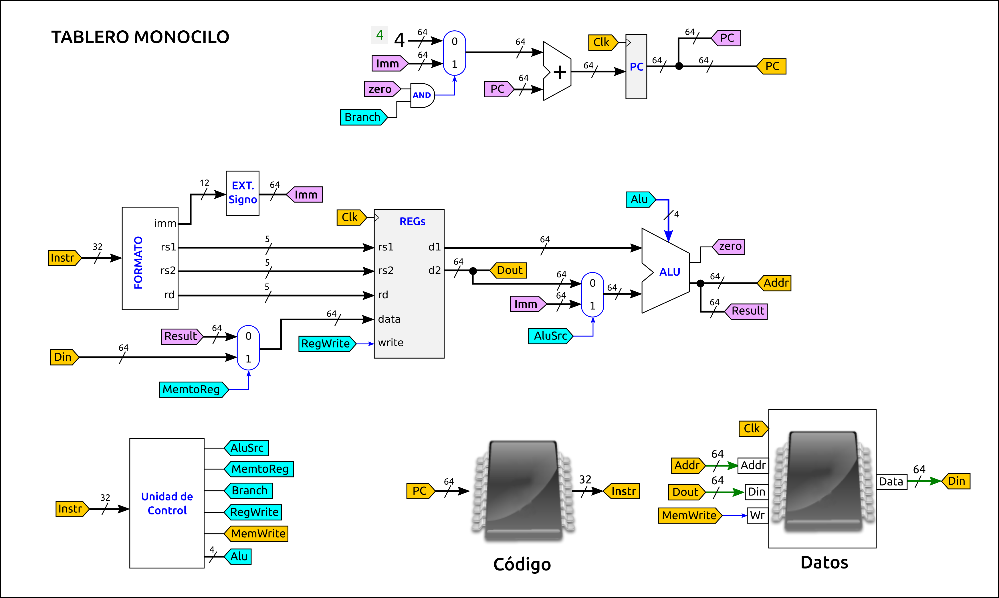

# Examen de Arquitectura de Computadores (GISAM)
* **Fecha**: 10-Enero-2022
* Tipo de examen: Presencial


## Pregunta 1 (2.5 puntos): Rendimiento 

* a) Calcula el número de ciclos de reloj totales que tarda cada computador en ejecutar el programa de pruebas (0.5)

Hay que multiplicar los CPI de cada computador con el número de intrucciones que tiene su programa ejecutable:

| Computador |  CPI | Instrucciones |Ciclos de reloj totales |
|------------|------|---------------|------------------------|
|  A         | 1    |  600          | 600                    |
|  B         | 1.2  |  700          | 840                    |
|  C         | 1.3  |  800          | 1040                   |


* b) Si sólo tuviésemos en cuenta el número de ciclos totales, ¿Qué computador tendría elegirías? (0.5)

Si sólo disponemos de ese dato, el computador que mejores valores presenta es el A, ya que es el que tarda menos ciclos de reloj. Por supuesto esta medida es engañosa. Necesitamos más información para determinar de verdad cuál es el que tiene mejor rendimiento

* c) Calcula el tiempo de CPU total que tarda cada computador en ejecutar el programa de pruebas (0.5)

Hay que multiplicar los ciclos totales que tarda el programa por el periodo de reloj de cada computador

Tcpu = Ciclos / Freq

| Computador | Ciclos | Freq (GHZ) |  Ciclos/Freq (ns) |
|------------|--------|------------|-------------------|
|  A         | 600    |  1         |  600              |
|  B         | 840    |  1.5       |  560              |
|  C         | 1040   |  2         |  520              |

* d) A partir de los datos obtenidos en los apartados anteriores, indica qué computador es el más rápido, y cuánto más rápido es uno sobre el otro (0.5)

El computador más rapido es el C, ya que es el que menos tiempo tarda en ejecutar el programa de pruebas (520ns). Para saber cuánto más rápido es con respecto a los otros computadores utilizamos el rendimiento relativo:

n1 = RendC/RendA = TcpuA / TcpuC = 600 / 520 = 1.15 (aprox)
n2 = RendC/RendB = TcpuB / TcpuC = 560 / 520 = 1.08 (aprox)

El computador C es aproximadamente 1.15 veces más rápido que el A, y 1.08 veces más rápido que el B

* e) Suponiendo que no podemos modificar ni el CPI y ni la frecuencia de cada comptuador, ¿Cómo podríamos mejorar los resultados del computador C? (0.5)

Podemos mejorar su rendimiento tocando la partes software: el compilador. Si optimizamos el compilador para que produzca menos instrucciones en su salida, bajará el número de ciclos totales y por tanto el tiempo de ejecución


## Pregunta 2 (2.5 Puntos): Repertorio de instrucciones

* a) Escribe un fragmento de programa en el ensamblador de este computador que realice esta operación (0.5)

Para realizar la operación pedida: `f = w + y - z` podemos elegir el registro que queramos, por ejemplo el x1:

```asm
add x1, w   #-- x1 = 0 + w
add x1, y   #-- x1 = x1 + y
sub x1, z   #-- x1 = x1 - z
store x1, f #-- Almacenar x1 en f
```

* b) Calcula el número de accesos totales a memoria que se realizan, indicando cuáles son de lectura y cuáles de escritura (0.5)

Las instrucciones están en memoria, por lo que para ejecutar cada una de ellas hay que leerla primero de memoria. Por tanto habrá 4 accesos de lectura para leer las instrucciones.

Al ejecutar las instrucciones add y sub, hay un acceso a memoria, para leer la variable indicada. En la instrucción estore hay 1 acceso de escritura

  * Número de accesos de lectura = 4 + 3 = 7
  * Número de accesos de escritura = 1
  * Total número de accesos a memoria: 8


* c) Calcula el tráfico total en bytes que se intercambian el procesador y la memoria principal (1)

A partir del formato de las instrucciones, vemos que tienen un tamaño de 72 bits (9 bytes). El tráfico generado para la lectura de las instrucciones es de 4 * 9 = 36 bytes.  Las variables de memoria son de 64 bits (8 bytes). En todas las instrucciones se lee o escribe una variable, por lo que se transfieren 4 * 8 = 32 bytes

Por tanto, el tráfico total es de: 36 + 32 = **68 bytes**


d) Supón que las variables w,y,z y f están situadas consecutivamente en la memoria, a partir de la dirección **0x0000000102A00E00**, escribe el código máquina del programa del apartado a) (Escribe las instrucciones en hexadecimal) (0.5)

Instrucción: add x1, w:  Opcode: 0x1, x1=0x1, w=0x000000102A00E00. Siguiendo el formato de la instrucción, se codifica así: 0x000000102A00E0011

Repetiendo para todas las instrucciones tenemos que el **código máquina** es:

```
0x0000000102A00E0011
0x0000000102A00E0811
0x0000000102A00E1012
0x0000000102A00E1813
```

## Pregunta 3 (2.5 Puntos): Circuitos lógicos

* a) Explica brevemente la estructura y componentes de este circuito (0.5)

El circuito está formado por la conexión en anillo de un registro de 16 bits (parte secuencial) con otro circuito combinacional, que a su vez está dividido en un sumador de 16 bits y un multiplexor (ambos combinacionales)

* b) Calcula el retardo de la parte combinacional (0.5)

El retardo de la parte combinacional lo determina el camino que va desde la salida del registro hasta llegar otra vez a su entrada: 2ns (sumador) + 2ns (mux) = 4ns

* c) Calcula la frecuencia máxima de funcionamiento a la que podría funcionar (0.5)

Para el cálculo de la frecuencia máxima tenemos que calcular el tiempo mínimo que transcurre desde que hay un dato estable en la entrada del registro hasta que llega un nuevo dato estable. Este tiempo es de: 4ns + 12ns = 16ns. Por tanto, la frecuencia máxima de funcionamiento es de: 1 / 16ns = 62.5Mhz


* d) Si inicialmente todas las señales están a 0, indica el valor del registro transcurridos 3 ciclos de reloj. La señal Sel está todo el tiempo a 0 y el valor inicial del registro es 0 (0.5)

Como la señal sel está a 0, lo que llega a la entrada del registro es su propio valor incrementado en dos unidades (configuración típica en anillo). Por tanto, en el primer ciclo se captura un 2, en el segundo un 4 y en el tercero habrá un 6

* e) ¿Qué ocurre cuando Sel se pone a 1 durante varios ciclos de reloj? (0.5)

  Cuando sel se pone a 1, lo que llega a la entrada del registro es un 8, por lo que el registro se carga con ese valor inicial. Mientras sel valga 1, el registro valdrá 8. Al ponerse sel a 0 de nuevo la cuenta continúa (pero esta vez empezando en 8)


## Pregunta 4 (2.5 Puntos): NanoRisc-V

* a) Calcular el retardo de cada una de las fases: Fetch, Decodificación, Ejecución, Acceso a memoria y WriteBack para las instrucciones addi, ld, sd y beq (1 pto)

El retardo de la fase Fetch lo determina la memoria de instrucciones. Fetch: 170ps. Es el mismo para todas las instrucciones

El retardo de la fase de decodificación está dado por el acceso al banco de registros (80ps) y el multiplexor del operando 2 de la alu (10ps): Total: 90ps

El retardo de la fase de ejecución está dado exclusivamente por la Alu: 50ps

El retardo de la fase de acceso a memoria lo determina la memoria de datos: 200ps

El writeback es de 0 para sd. La instrucción de addi realiza una escritura en el banco de registros, y hay que tener en cuenta el retardo del multiplexor de la entrada de datos (10ps). Lo mismo ocurre con load, que también escribe en el banco de registros (10ps). Para la instrucción beq hay que tener en cuenta el retardo del multiplexor y el del sumador (10ps + 20ps = 30ps)

  * Instrucción **addi**:
    * Fetch: 170 ps, Decod: 90 ps, Ejec: 50ps,  WB: 10ps Total: **320 ps**
  * Instrucción **ld**:
    * Fetch: 170ps, Decod: 90 ps, Ejec: 50ps, Mem: 200ps. WB: 10ps Total: **520 ps**
  * Instrucción **sd**:
    * Fetch: 170ps, Decod: 90 ps, Ejec: 50ps, WB: 0. Total: **310 ps**
  * Instrucción **beq**:
    * Fetch: 170ps, Decod: 90 ps, Ejec: 50ps, WB: 30 ps. Total: **340 ps**


* b) Indicar cuál es la instrucción crítica y calcular la frecuencia máxima de funcionamiento (0.5)

La instrucción crítica es la que tarda más tiempo en ejecutarse. Es la de load, con un retardo de 520ps. Por tanto, será la instrucción que determina la frecuencia máxima de funcionamiento del procesador: 1 / 520ps = 1.92Ghz (aprox.)

* c) Queremos mejorar el rendimiento utiliando segmentación. ¿Cual será la nueva frecuencia maxima del procesador? (0.5)

Para segmentarlo hay que utilizar como frecuencia la de la etapa más crítica, que es la de acceso a memoria (200ps). Por tanto, la nueva frecuencia será 1 / 200ns = **5Ghz**

* d) Si tenemos un programa de prueba formado únicamente por una instrucción, ¿Cuánto ciclos de reloj tardará el procesador segmentado en ejecutarla? (0.5)

  La versión segmentada está formada por 5 etapas, y cada etapa se ejecuta en un ciclo de reloj. En total la instruccion tarda 5 ciclos de reloj

### Figura del Risc-V Monociclo



