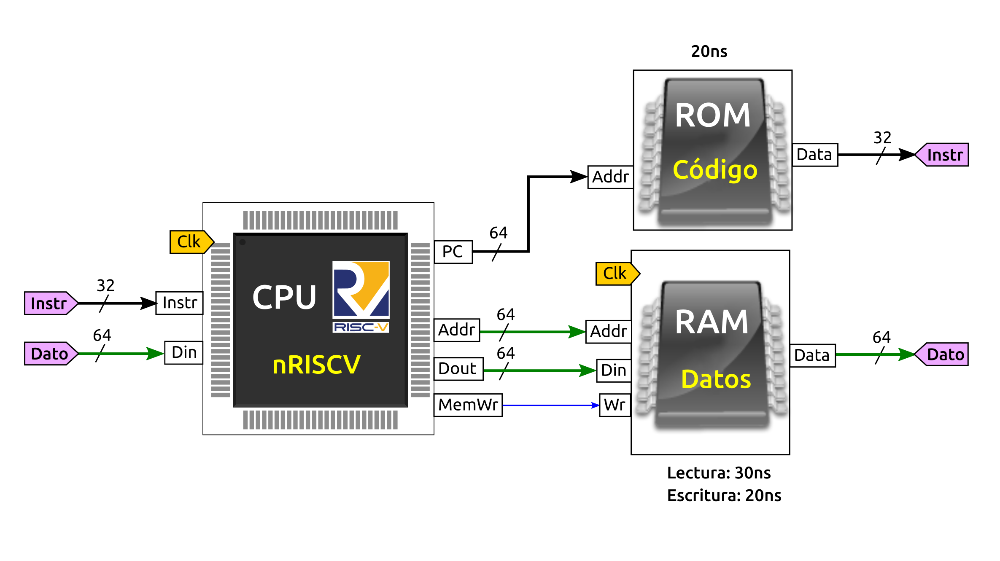

# S7: Problema de Computador nanoRiscV

Tenemos un computador nano-RISCV como el mostrado en la siguiente figura

El retardo de lectura de la memoria ROM es de 20ns. La memoria RAM tiene un retardo de lectura de 30ns y de 20ns para la escritura.

También se conocen los retardos de las siguientes fases, que son iguales para todas las instrucciones:

* Decodificación: 5 ns
* Ejecución: 5 ns
* Write-back: 0ns

Las fases de Fetch y acceso a memoria están determinadas por los retardos de las memorias utilizadas

El resto de retardos se consideran despreciables (0 ns)

Se pide:

**a)** (1.2 ptos) Calcula cuál es el retardo de la fase de Fetch
**b)** (1.2 ptos) Calcula el tiempo que tardan las instrucciones de tipo R
**c)** (1.3 ptos) Calcula el tiempo que tarda la instrucción ld
**d)** (1.3 ptos) Calcula la frecuencia máxima de funcionamiento de este computador

# Solución

**a)** En la fase de Fetch es donde se cargan las instrucciones de la memoria ROM. Su retardo está determinado por el retardo de lectura de la memoria ROM que es de 20ns. El resto de retardos es cero por tanto:

Retardo Fetch = 20 ns

**b)** En el caso de las instrucciones de tipo R, que en el nano-RISC son add, sub, and y or, no hay fase de acceso a memoria. Los retardos de estas instrucciones están datos por:

retardo_R = R_fetch + R_decodificación + R_ejecución + R_memoria + R_writeback = 20ns + 5ns + 5ns + 0ns + 0ns = 30ns

**c)** La instrucción ld además de los retardos anteriores (que en este ejemplo son iguales para todas las instrucciones) tenemos el retardo debido a la lectura de los datos de la memoria RAM, que es de 30ns. Por tanto, el retardo de ls es de 20ns + 5ns + 5ns + 30ns + 0ns = 60ns

**d)** Para calcular la frecuencia máxima necesitamos conocer el caso peor (la instrucción más lenta). La instrucción de beq y de store, en este problema, tienen los mismos retrasos que las instrucciones R

La escritura en la memoria RAM tarda 20ns, pero se realiza en paralelo con las fases de fetch y decodifación por lo que no forma parte del retardo del ciclo actual

Por ello, la instrucción que más tarda es ld, y por ello, la frecuencia máxima está dada por fmax = 1 / 60ns = 16.7 MHZ (aprox).

