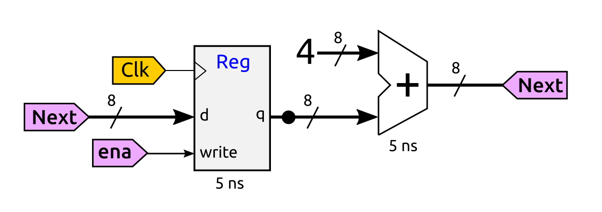
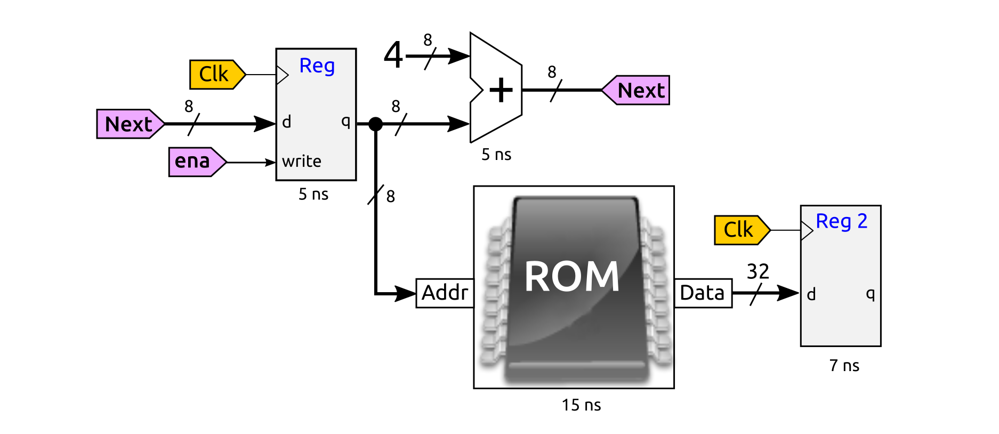

# S7: Problema de Computador nanoRiscV

Dado el siguiente circuito:



Se pide:

**a)** (1 pto) Describe brevemente los elementos de este circuito, y de qué tipo son (combinacionales/secuenciales)

**b)** (1 pto) Suponiendo que la señal ena está a `1` todo el tiempo, y que inicialmente el registro tiene el valor 0, Indica la salida de este registro en los siguientes 3 ciclos de reloj (tras 3 flancos de subida del reloj)

**c)** (1 ptos) Calcula su frecuencia máxima

**d)** (1 pto) Ahora añadimos una memoria ROM. Su salida se almacena en el registro 2. Calcula la frecuencia máxima de este nuevo circuito



**e)** (1 pto) La memoria ROM contiene la siguiente información en hexadecimal (Comenzando en la dirección 0):

```
10000413
00040283
0012f293
00100313
fe628ae3
```

Inicialmente los dos registros están a 0. La señal **ena** permance a 0 todo el tiempo. Indica el valor que tendrá el registro 2 al llegar el primer y segundo flancos de reloj (ciclos 1 y 2)

# Solución

**a)** El circuito está formado por dos elementos: Un registro de 8 bits con entrada de escritura (es un circuito secuencil) y un sumador de dos números de 8 bits (es combinacional). Uno de los operandos de este sumador está cableado al número 4, por lo que siempre suma 4. El circuito completo está formado por una parte secuencial y una combinacional, realimentadas a través de la señal next

**b)** Cuando ena está a 1, la señal write el registro está también a 1, por lo que realiza  capturas en todos los ciclos de reloj. Inicialmente parte del valor 0. El valor siguiente será 4. Durante el ciclo 0 (antes de llegar el primer flanco de subida) el registro está a cero. Tras el primer flanco (primer ciclo), el registro vale 4. En el siguiente ciclo 8 y en el tercero 12 (0x0C en hexadecimal): 0, 4, 8 y 12

**c)** Desde que llega un flanco de subiba hasta que tenemos datos estables a la entrada del registro transcurren 5ns + 5ns = 10ns. Su frecuencia máxima será por tanto de 1 / 10ns = 100Mhz

**d)** Hay que garantizar que ambos registros capturen valores estables. El primer registro (el original) tiene información estable transcurridos 10ns (igual que antes). Pero el registro 2 tiene información estable en su entrada transcurridos 5ns + 15ns = 20ns. Este es el caso peor. Por tanto, la frecuencia máxima será 1 / 20ns = 50Mhz 

**e)** Como **ena** está a 0, el primer registros siempre estará a 0, en todos los siguientes ciclos de reloj. Por tanto, a la salida de la memoria se tendrá el valor 0x10000413 en todos los ciclos. El registro 2 por tanto capturará siempre el valor 0x10000413, tanto en el primer flanco como en el segundo
