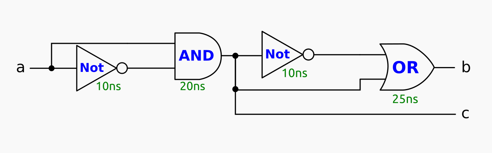
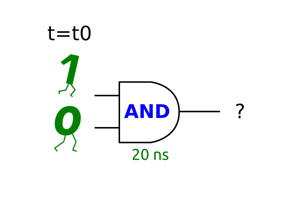
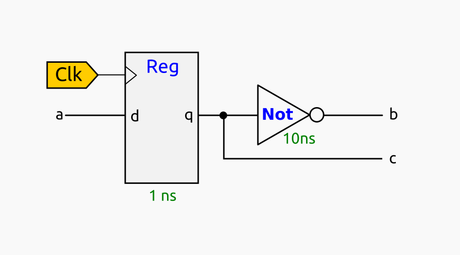

# Parcial 3. Test de Teoría
# Las respuestas incorrectas restan un 25%
# Temario:
* Sesión S9: Nivel de Electrónica Digital
* Sesión S10: El computador NanoRisc-V

**Nota**: La respuesta correcta siempre es la primera

### 1) S9: Circuitos lógicos

Dado el siguiente circuito digital, indica la respuesta correcta:

1. Es un circuito combinacional, que tiene una entrada de un bit y dos salidas también de 1 bit
2. Es un circuito combinacional, con un retardo de 30ns
3. Es un circuito secuencial, que almacena un número de 2 bits
4. Es un circuito con dos salidas, con retardos de 65ns y 40ns 

### 2) S9: Circuitos y retardos

Calcula el retardo del siguiente circuito digital:

1. 65 ns
2. 30 ns
3. 40 ns
4. 20 ns

### 3) S9: Circuitos y retardos (II)

Tenemos una puerta AND. En el instante t0 sus entradas toman los valores 1 y 0. Indica qué afirmación es la correcta

1. La salida será 0, para t >= (t0 + 20 ns) e indefinida para t<(t0 + 20ns)
2. La salida en cualquier instante posterior a t0 será 0, ya que 1 por 0 es siempre 0 en la lógica booleana
3. La salida será 0 cuando t < (t0 + 20 ns) y 1 en el resto de instantes
4. La salida será indefinida para t < (t0 + 10 ns), y 0 en el resto de instantes

### 4) S9: Circuitos y frecuencia máxima

Dado el siguiente circuito, indica qué afirmación es la correcta

1. La frecuencia máxima de funcionamiento es de 90.9 Mhz aproximadamente
2. No hay datos suficientes para calcular su frecuencia máxima de funcionamiento
3. La frecuencia máxima de funcionamiento es mayor que 100Mhz
4. Este circuito puede funcionar a 1 Ghz, sin problemas

### 5) S9: Criterio de estabilidad

Respecto a la frecuencia máxima de un circuito, indica qué afirmación es correcta:

1. Para obtenerla hay que calcular el periodo del reloj que garantiza que se capturan los datos cuando son estables
2. Si se usa una frecuencia mayor a la máxima, el circuito se quema
3. Si se usa una frecuencia mucho menor a la máxima, el circuito entra en resonancia y deja de funcionar
4. La frecuencia máxima siempre es mayor a 100Mhz

### 6) S10: nRiscV y Turing

Indica qué afirmación relativa al procesador nano-RISCV es correcta:

1. Aunque sólo tiene 8 instrucciones, tiene una potencia computacional igual a la máquina de Turing (Es turing completo)
2. Al tener pocas instrucciones, no se pueden implementar en el nano-RISCV todos los algoritmos que sí se podrían programar con un RISCV completo 
3. En el nano-RISCV no se puede llamar a subrutinas, y por eso no tiene la misma potencia computacional que el RISCV convencional
4. En el nano-RISCV no se pueden realizar saltos incondicionales, porque no tiene implementada la intrucción b (branch)  

### 7) S10: nRISCv y código máquina

Dada la siguiente instrucción en código  máquina `01FFFFB3`, indica qué afirmación es correcta

1. Es una intrucción de tipo R
2. Es una instrucción de tipo S
3. No es una instrucción correcta del nano-RISCV
4. Es una intrucción que utiliza como registro destino x30

### 8) S10: nRV y código máquina II

Se tiene la siguiente instrucción del nanoRisc-V: `ld x1, 0x100(x0)`. Indica la afirmación correcta

1. Transfiere la doble palabra (64-bits) almacenada en la dirección 0x100 de memoria al registro x1
2. Es una instrucción incorrecta del nanoRiscv: El registro x0 no se puede usar como registro fuente
3. Es una instrucción incorrecta del nanoRiscv: El registro destino no puede ser x1
4. Almacena el registro x1 en memoria, en la dirección indicada por el registro x0

### 9) S10: Computador nRISC-V y RAM

Indica la afirmación correcta, relativa a la memoria RAM usada en el computador nano-RISCV

1. Almacena los datos. Es un circuito combinacional en la lectura y secuencial en la escritura
2. Almacena el código máquina del programa actual en ejecución
3. Es un circuito secuencial tanto en lectura como en escritura
4. La escritura se realiza cada vez que llega un dato nuevo por su entrada de datos

### 10) Computador nRISC-V

Indica la respuesta correcta

1. El computador nanoRiscV lo construimos con la CPU del nanoRISCV y dos memorias separadas: una para el código y otra para los datos
2. El computador nanoRiscV funciona siempre a una frecuencia superior a 200Mhz
3. El computador nanoRiscV, al encenderse, comienzo a ejecutar las instrucciones almacenadas a partir de la dirección 0x100
4. El computador nanoRiscV termina sus programas llamando al sistema operativo

 
