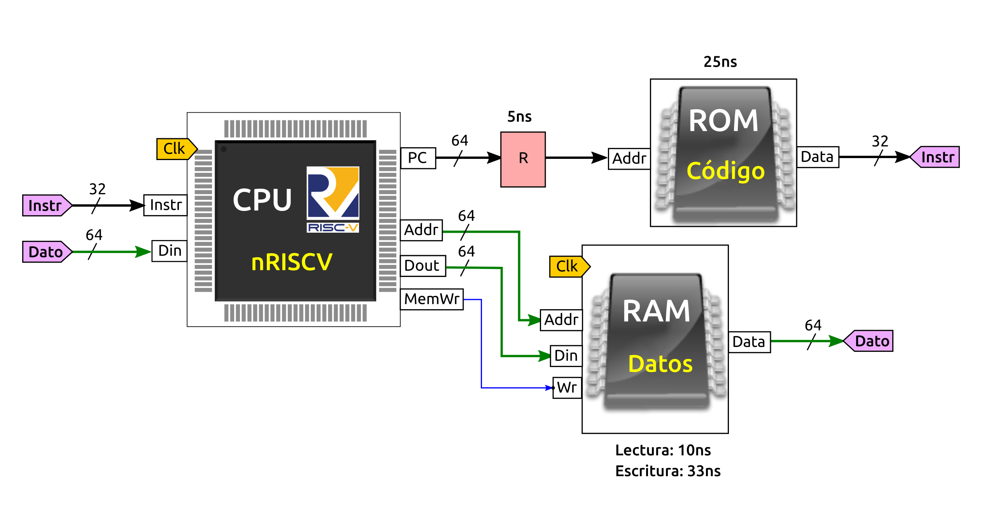

# S7: Problema de Computador nanoRiscV

Tenemos un computador nano-RISCV como el mostrado en la siguiente figura

Debido a un fallo de fabricación, el cable del bus que conecta el  **PC** con la memoria ROM añade un retardo de 5ns. En el esquemático se ha indicado con el componente rojo R. Los retardos introducidos por el resto de componentes se describen a continuación:

* **Registro PC**: Tiene un retardo de 6ns en la escritura
* **Memoria ROM**: 25ns
* **Memoria RAM**: 10ns de lectura, y 33ns de escritura
* **Fase de decodificación**: Retardo de 6ns
* **Fase de ejecución**: El retardo varía según la instrucción ejecutada:
  * Instrucción Sub: 15ns
  * Instruccion And: 10ns
  * Resto de instrucciones: 8ns 
* **Fase de Write-back**: 0 ns

El resto de retardos se consideran despreciables (0 ns)

Se pide: 

**a)** (1 pto) Calcula el retardo de la fase de Fetch  
**b)** (1 pto) Calcula el tiempo que tarda la instrucción `addi t1,t0,1`  
**c)** (1 pto) Calcula el tiempo que tarda la instrucción `ld t0,0(zero)`   
**d)** (1 pto) Calcula la frecuencia máxima de funcionamiento de este computador  
**e)** (1 pto) Si ahora arreglamos el error del cable de manera que no introduzca ningún retraso, ¿Cual sería la nueva frecuencia de funcionamiento?  

# Solución

**a)** La fase de fetch transcurre desde el final del ciclo anterior (donde se actualiza el estado de procesador y por tanto se inicia la escritura en el PC) hasta que tenemos la instrucción disponible (código máquina). El retardo total está dado por el retardo del registro PC (6ns) más el retardo producido por el error en el cable (5ns) más el retardo de la memoria ROM: 25ns

* **Retardo de Fetch**: 6 + 5 + 25 = **36 ns**

**b)** La instrucción addi NO accede a memoria por lo que el tiempo de la fase de acceso a memoria es de 0 ns. En la fase de ejecutación tarda 8ms (según especificaciones). Sumando los retardos de todas las fases obtenemos:

* **Retardo de addi**: Retardo Fetch + Retardo decodificación + retardo ejecución + retardo acceso memoria + retardo write back = 36 + 6 + 8 + 0 + 0 = 50

**c)** La instrucción ld tarda los siguientes tiempos en las fases:

* Fetch: 36
* Decodificación: 6
* Ejecución: 8 
* Acceso memoria: 10ns
* Write-back: 0ns

* **Retardo de ld**: 36 + 6 + 8 + 10 = 60ns

**d)** Para calcular la frecuencia máxima de funcionamiento hay que encontrar el caso peor. La fase de Fetch es la misma para todas las instrucciones. El retardo de la decodificación está fijado a 6ns. La instrucción más lenta en la fase de ejecución seria Sub, con un valor de 15.

El retardo de sub es de 36 + 6 + 15 + 0 + 0 = 57ns

Como la instrucción de load (ld) tiene un retardo mayor (60ns) es nuestro caso peor. Por tanto, El periodo mínimo del reloj es de 60ns. Lo que nos da una frecuencia máxima de: 1 / 60ns = **16.7 Mhz (aprox)**

**e)** En este caso se ve afectado sólo el ciclo de Fetch, que pasaría a ser de 6 + 25 = 31 ns. Esta fase afecta a todas las instrucciones por igual por lo que todas se reducen en 6ns. El caso peor sigue siendo, por tanto, la instrucción de load que ahora tendrá un retardo de 31 + 6 + 8 + 10 = 55ns.

La nueva frecuencia de funcionamiento es de 1 / 55ns = **18.2 Mhz (aprox)**

