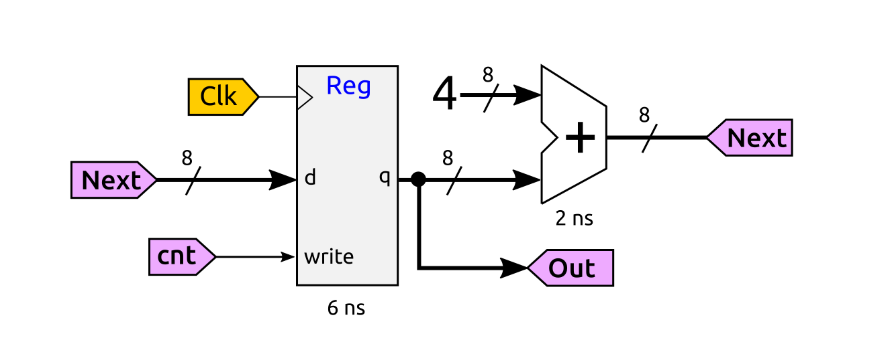

# Problema Teoría. Convocatoria Extraordinaria. Lunes, 17-Junio-2024
* Puntuacion: 10 ptos

## Problema 3 (2.5 ptos): Electrónica digital

Tenemos el siguiente circuito digital

Responde a las siguientes preguntas:

**a)** (0.5 ptos) Indica cuál es la parte combinacional de este circuito y qué retardo tiene

**b)** (0.5 ptos) Indica cuál es la parte secuencial de este circuito y qué retardo tiene

**c)** (0.5 ptos) Indica el retardo total del circuito completo

**d)** (0.5 ptos) Calcula la frecuencia máxima de funcionamiento de este circuito

**e)** (0.5 ptos) Si inicialmente el registro tiene un valor de 0, y la señal `cnt` tiene un valor de 1 (ciclo 0), indica el valor de la señal `out` durante los 3 siguientes ciclos de reloj (ciclos 1, 2 y 3)

# Solución

**a)** Este cicuito está formado por dos elementos: un registro de 8 bits (secuencial) y un sumador de 2 operandos de 8 bits (combinacional). La parte combinacional es este circuito sumador, que tiene un retardo de 2 ns

**b)** La parte secuencial del circuito es el registro de 8 bits, que tiene un retardo de 6 ns

**c)** Se trata de la conexión en cascada de un circuito secuencial con otro combinacional, por tanto el retardo total es la suma de ambos retardos: 6 ns + 2 ns = 8 ns

**d)** La frecuencia máxima de este circuito es la inversa del retardo mínimo del circuito, calculado en el apartado anterior. Fmax = 1 / Tmin = 1 / 8 ns = 125 Mhz

**e)** En el ciclo 0, la señal cnt vale 1, y el valor el registro es de 0 (situación inicial).  El valor en el siguiente ciclo (ciclo 1) será el valor del contador en el ciclo 0 (0) al que se le suma 4. Como cnt está a '1', este valor se captura en el siguiente ciclo. Esto se repite en el resto de ciclos obteniéndose una de cuenta de 4 en 4: 0, 4, 8, 12...

Por tanto, en los ciclos 1,2 y 3, el valor de out será de 4, 8 y 12 respectivamente

