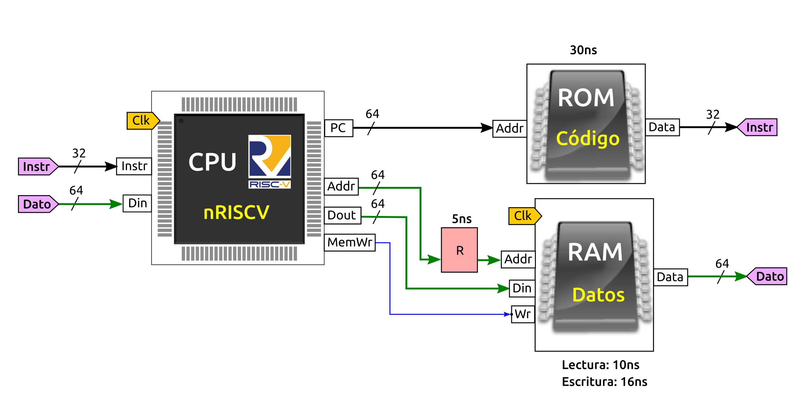

# Problema Teoría. Convocatoria Extraordinaria. Lunes, 17-Junio-2024
* Puntuacion: 10 ptos

## Problema 4 (2.5 ptos): Computador nanoRiscV

Tenemos un computador nano-RISCV como el mostrado en la siguiente figura

El cable de bus **Addr** que conecta con la memoria RAM añade un **retardo de 5ns**, debido a un defecto en su fabricación. En el esquemático se ha indicado con el componente rojo R. Los retardos introducidos por el resto de componentes se describen a continuación:

* **Memoria ROM**: 30ns
* **Memoria RAM**: 10ns de lectura, y 16ns de escritura
* **Fase de decodificación**: Retardo de 10ns
* **Fase de ejecución**: 15ns
* **Fase de Write-back**: 0 ns

El resto de retardos se consideran despreciables (0 ns)

Se pide: 

**a)** (1 pto) Calcula el retardo de la fase de Fetch  
**b)** (1 pto) Calcula el tiempo que tarda la instrucción `or t5,t1,t2`  
**c)** (1 pto) Calcula el tiempo que tarda la instrucción `ld t2,0(zero)`   
**d)** (1 pto) Calcula la frecuencia máxima de funcionamiento de este computador  
**e)** (1 pto) Si ahora arreglamos el error del cable de manera que no introduzca ningún retraso, ¿Cual sería la nueva frecuencia de funcionamiento?  

# Solución

**a)** Puesto que el retardo del PC es despreciable (0ns), la fase de fetch está determinada por el retardo de la memoria ROM: 30ns

* **Retardo de Fetch**:  **30 ns**

**b)** La instrucción `or` NO accede a memoria por lo que el tiempo de la fase de acceso a memoria es de 0 ns. En la fase de ejecutación tarda 15ms (según especificaciones). Sumando los retardos de todas las fases obtenemos:

* **Retardo de or**: Retardo Fetch + Retardo decodificación + retardo ejecución + retardo acceso memoria + retardo write back = 30 + 10 + 15 + 0 + 0 = 55ns

**c)** La instrucción ld tarda los siguientes tiempos en las fases:

* Fetch: 30
* Decodificación: 10
* Ejecución: 15
* Acceso memoria: 10 (lectura ram) + 5ns (fallo cable) = 15ns
* Write-back: 0ns

El retardo del bus Addr influye sólo en el acceso a memoria, por lo que el retardo es el de la RAM + 5ns = 15ns

* **Retardo de ld**: 30 + 10 + 15 + 15 + 0 = 70ns

**d)** Para calcular la frecuencia máxima de funcionamiento hay que encontrar el caso peor. La fase de Fetch es la misma para todas las instrucciones. El retardo de la decodificación está fijado a 10ns. Y La fase de ejecución a 15.

El caso pero, por tanto, es la instrucción de load (ld), que además de los tiempos anteriores añade el acceso a memoria: 15ns (contando con el fallo del cable)

Por tanto, El periodo mínimo del reloj es de 70ns. Lo que nos da una frecuencia máxima de: 1 / 70ns = **14.3 Mhz (aprox)**

**e)** En este caso se ve afectado sólo el ciclo de acceso a memoria, que pasaría a ser de 10 ns. El caso peor sigue siendo la instrucción de load que ahora tendrá un retardo de 30 + 10 + 15 + 10 + 0 = 65ns.

La nueva frecuencia de funcionamiento es de 1 / 65ns = **15.4 Mhz (aprox)**

